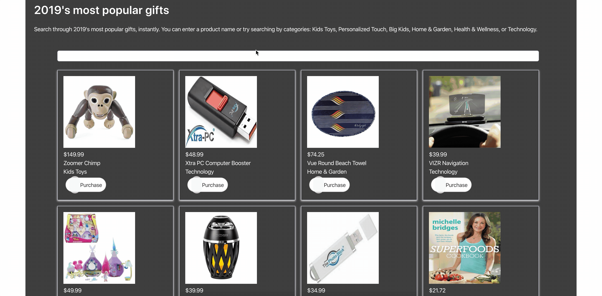

# Giftify
Looking for that **perfect** gift, but don't know where to start? Well we have the perfect app for you!

## Installation
No installation required. Simply visit [Giftify] (https://giftify-project2.herokuapp.com/) and get started!

## Purpose
This application helps the user search for and buy the perfect gift for their special someone. They can choose from a selection of Featured and Top Rated Gifts, or they can search for a gift directly from the homepage. 

## Functionality
This page uses two different third-party APIs (**Etsy** and **Algolia**). The Etsy API allows the user to search for items by a keyword, then displays the results directly on the home page. Once a term is searched, it is stored in a recent searches table, which will allow the user to click a button and return to that search later.

Algolia allows the user to search through a defined array of gifts. It also serves as an auto-complete function, which will start displaying results as soon as the first key is typed.

Once the perfect gift is found, the gift-giver can click a link directing them to buy the item.

## Contributions/Resources
* Group Members: [Cory Marshman] (https://github.com/cmarshman), [Greg Roberts] (https://github.com/groberts31), [Johan Bueno] (https://github.com/johanbueno), and [JT Turner] (https://github.com/javierturner)

* Other Contributors: UNCC TAs, Rodney Brenes (Instructor)

* API/Framework Resources: 
  - [Etsy API] (https://www.etsy.com/developers/documentation/getting_started/api_basics)
  - [Algolia API] (https://www.algolia.com/doc/)
  - [Bulma Framework] (https://bulma.io/documentation/)

## Links
    * Deployed Application: https://giftify-project2.herokuapp.com/
    * Github Pages: https://github.com/cmarshman/project2

## Images
Login Page +++++++++++++++++++++++++++++++++++++

## License
MIT License

Copyright (c) [2020] [Cory_Marshman/Greg_Roberts/Johan_Bueno/JT_Turner]

Permission is hereby granted, free of charge, to any person obtaining a copy of this software and associated documentation files (the "Software"),to deal in the Software without restriction, including without limitation the rights to use, copy, modify, merge, publish, distribute, sublicense, and/or sell copies of the Software, and to permit persons to whom the Software is furnished to do so, subject to the following conditions: The above copyright notice and this permission notice shall be included in all copies or substantial portions of the Software.

THE SOFTWARE IS PROVIDED "AS IS", WITHOUT WARRANTY OF ANY KIND, EXPRESS OR IMPLIED, INCLUDING BUT NOT LIMITED TO THE WARRANTIES OF MERCHANTABILITY, FITNESS FOR A PARTICULAR PURPOSE AND NONINFRINGEMENT. IN NO EVENT SHALL THE AUTHORS OR COPYRIGHT HOLDERS BE LIABLE FOR ANY CLAIM, DAMAGES OR OTHER LIABILITY, WHETHER IN AN ACTION OF CONTRACT, TORT OR OTHERWISE, ARISING FROM, OUT OF OR IN CONNECTION WITH THE SOFTWARE OR THE USE OR OTHER DEALINGS IN THE SOFTWARE.
